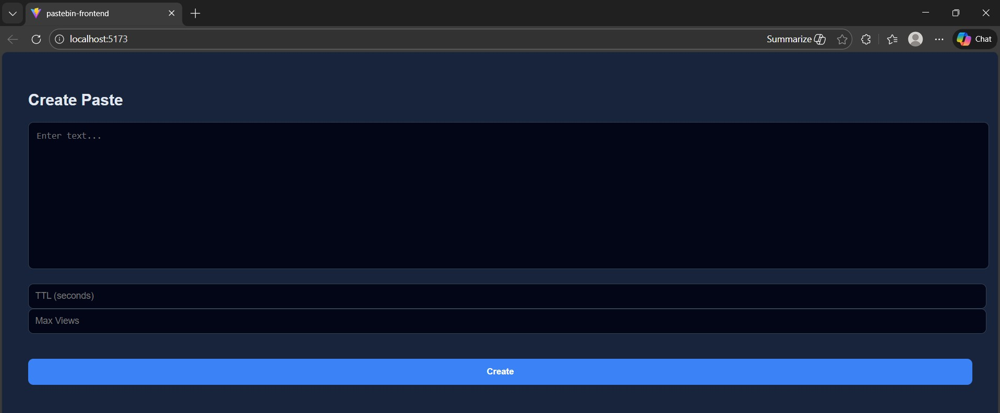
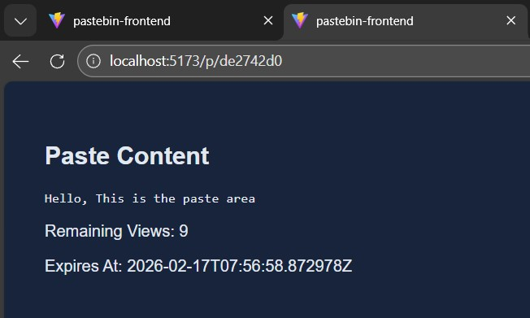
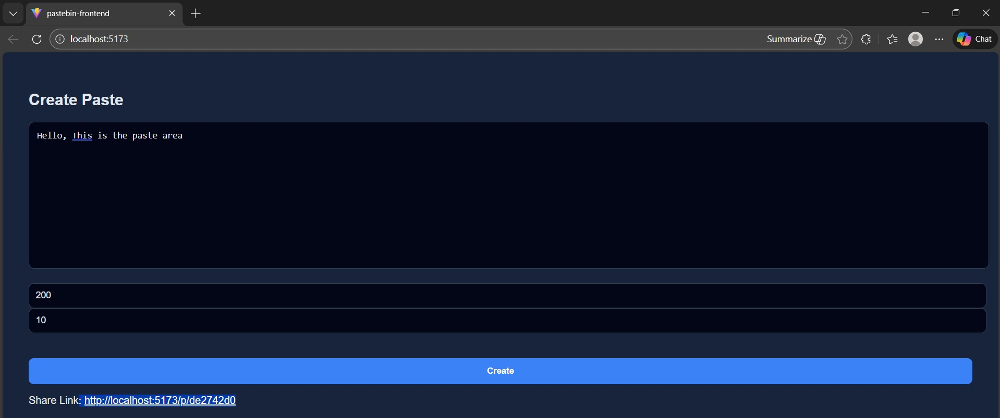

# Pastebin Web Application

A full-stack Pastebin-like web application built using **Spring Boot, React, and PostgreSQL**.  
Users can create text snippets and share them via a unique link. Each paste can expire based on **time** or **number of views**.

This project demonstrates backend API design, database persistence, and frontend integration.

---

## Application Preview

### Create Paste Page

### View Paste Page

### Paste Example

---

## Features

- Create and share text snippets
- Unique shareable link generation
- Expiration by time (TTL)
- Expiration by maximum views
- Remaining views tracking
- REST API backend
- PostgreSQL database integration
- React frontend
- Clean MVC architecture

---

## Tech Stack

### Backend
- Java
- Spring Boot
- Spring Data JPA
- PostgreSQL
- Maven

### Frontend
- React (Vite)
- React Router
- Fetch API
- CSS

### Database
- PostgreSQL

---

## Project Structure

